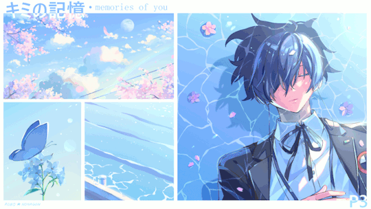

<div align="center">


# Ciaossu, I'm LazyPota

**12th Grade Vocational Student** | **Machine Learning Student Researcher** | **Mobile & Backend Developer** | **Robotics Enthusiast**

[](https://github.com/LazyPota)
[](https://github.com/LazyPota)
[](https://github.com/LazyPota)



<p><em>"May you simply fold your wings and rest"</em></p>
</div>

## About Me

I'm a passionate 12th-grade vocational student deeply invested in research, particularly in Mathematics and Machine Learning. My journey focuses on creating impactful applications and exploring the intersections of software and hardware. In my free time, I love diving into robotics, developing robust backend systems, creating mobile apps, and continuously learning new aspects of software development.

```python
class Rei:
def __init__(self):
self.name = "Rei"
self.role = "Student Researcher & Developer"
self.location = "Indonesia"
self.interests = ["Mathematics", "Machine Learning", "Robotics", "Backend Systems", "Mobile Development"]
self.current_focus = "Research and building AI & Robotics solutions"

def get_skills(self):
return {
"languages": ["Python", "Java", "Kotlin", "JavaScript", "C++"],
"frameworks": ["FastAPI", "Android SDK"],
"ml_tools": ["TensorFlow", "scikit-learn", "OpenCV"],
"tools": ["Git", "Docker", "Hostinger"]
}
```

# GitHub Stats:
<div align="center">
  
</div>

## Featured Projects

<table>
<tr>
<td width="50%">
 <h3>EcotionBuddy</h3>
 <p><strong>Android App for Waste Classification</strong></p>
 <p>An AI-powered mobile application that helps users identify different types of waste and provides recycling guidance. Features on-device image classification and educational resources.</p>
 <p><em>Tech Stack: Android, Kotlin, TensorFlow Lite, Computer Vision</em></p>
</td>
<td width="50%">
 <h3>Moneasy</h3>
 <p><strong>ML Microservice with FastAPI</strong></p>
 <p>A machine learning model served as a REST API that predicts financial health scores based on user inputs. Designed for scalability and easy integration.</p>
 <p><em>Tech Stack: Python, FastAPI, scikit-learn, Docker</em></p>
</td>
</tr>
<tr>
<td width="50%">
 <h3>Project Clarias</h3>
 <p><strong>Integrated Smart Aquaculture Platform</strong></p>
 <p>An IoT monitoring and cloud-based dashboard system designed to assist catfish farmers with data-driven decisions and predictive analytics for harvest estimation.</p>
 <p><em>Tech Stack: IoT (ESP32), Cloud Dashboard, Predictive Analytics, C++</em></p>
</td>
<td width="50%">
 <h3>FTC PID & Automation Algorithm Codeset</h3>
 <p><strong>Robotics Control System</strong></p>
 <p>A comprehensive codeset for FTC robotics containing PID controllers and automation algorithms for precise movement and autonomous tasks. (to be released soon)</p>
 <p><em>Tech Stack: Java, Control Theory, FTC SDK</em></p>
</td>
</tr>
</table>

## Awards

- FTC Decode Season 2nd Inspire Award (Highest Appreciation in Program, Design and Engineering)
- Garuda Hacks 7.0 Runner Up Pre-University Award
- SFT 2025 Finalists
- DBS X Dicoding Coding Camp 2024 Best Capstone Project
- Hack Club Jakarta 2x Winner (Campfire & DayDream)
- LKS ITSSB 2024 2nd Place
- Many more Awards

##  Tech Stack

<div align="center">

### Languages


### Frameworks & Databases


### ML & DevOps Tools


</div>

## GitHub Analytics

<div align="center">


</div>

<div align="center">

</div>

## What I'm Learning

- **Advanced Machine Learning**: Deep diving into neural networks and computer vision
- **Mobile Development**: Mastering Android architecture patterns and UI/UX design  
- **Backend Optimization**: Exploring microservices architecture and API design
- **DevOps Practices**: Learning CI/CD pipelines and cloud deployment strategies

## Let's Connect & Collaborate

I'm always excited to work on innovative projects and learn from fellow developers! Here's how you can reach me:

<div align="center">

[](mailto:rafilpersada618@gmail.com)
[](https://x.com/PotaaaKui)
[](https://github.com/LazyPota)

</div>

## Open for Collaboration

<div align="center">

</div>

Looking for opportunities to collaborate on:
- **AI/ML Projects**: Computer vision, NLP, or data science initiatives
- **Mobile Applications**: Android apps with real-world impact
- **Backend Services**: API development and microservices architecture
- **Sustainability Tech**: Environmental solutions through technology

---

<div align="center">


**"Code is like humor. When you have to explain it, it's bad."** – Cory House

<p><em>If you find my projects interesting, don't forget to star them!</em></p>

</div>
